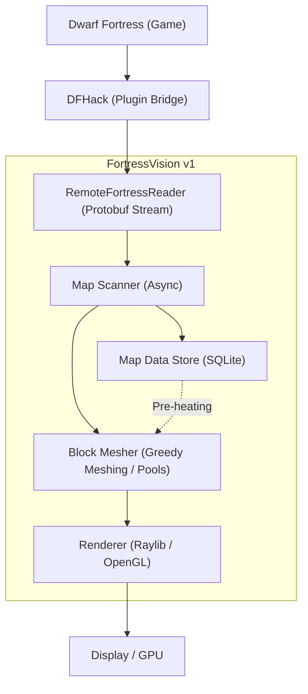

# FortressVision v1


**FortressVision** é um visualizador 3D de alta performance para **Dwarf Fortress**, construído utilizando **Go** e a biblioteca gráfica **Raylib**. Ele se conecta ao DFHack para extrair dados em tempo real da sua fortaleza e renderizá-los em um ambiente tridimensional imersivo.

## 🧭 Como Funciona

O FortressVision atua como um cliente especializado que "escuta" o estado do mundo do Dwarf Fortress e o reconstrói localmente para exibição gráfica.




## 🚀 Principais Funcionalidades

### 🏗️ Renderização Otimizada (Greedy Meshing)
Utilizamos um algoritmo de **Greedy Meshing** para reduzir drasticamente o número de polígonos. Ao agrupar faces de blocos idênticos em "fitas" geométricas, conseguimos reduzir as *Draw Calls* e a contagem de triângulos em até 70%, garantindo uma taxa de quadros estável mesmo em fortalezas gigantescas.

### 💾 Persistência e Carga Offline (SQLite)
O projeto integra um banco de dados local **SQLite**. Cada mundo visitado é salvo automaticamente, permitindo carregar o terreno instantaneamente no próximo boot sem depender exclusivamente do streaming lento do DFHack. O sistema de "Pre-heating" reconstrói o mapa a partir do disco em milissegundos.

### 🌊 Fluidos Dinâmicos e Shaders
A água não é apenas um bloco transparente; ela utiliza **Surface Merging** para criar superfícies contínuas e orgânicas. Além disso, implementamos **Flowing Shaders** em GLSL que interpretam os vetores de correnteza reais do Dwarf Fortress, criando animações de rios e cascatas baseadas na física do jogo.

### ⚡ Performance Extrema
- **Memory Pooling:** Uso intensivo de `sync.Pool` para reciclar buffers de geometria e evitar pausas do Garbage Collector (GC).
- **Thermal Throttling de VRAM:** O upload de malhas para a GPU é controlado por um orçamento de tempo por frame, eliminando "stutters" durante a navegação.
- **Multithreading:** Meshing e Scanner rodam em goroutines separadas, mantendo a thread principal focada apenas na renderização e entrada do usuário.

## 🛠️ Tecnologias Utilizadas

*   **Linguagem:** Go (Golang) 1.21+
*   **Gráficos:** Raylib (via CGO)
*   **Protocolo:** gRPC / Protobuf (via DFHack RemoteFortressReader)
*   **Persistência:** GORM + SQLite
*   **Matemática 3D:** Mathgl (mgl64)

## 📦 Como Compilar

### Pré-requisitos
1.  Instale o **Go 1.21+**.
2.  Instale um compilador C para Windows (Recomendado: **MingW-w64** via niXman ou TDM-GCC).
3.  Tenha o **Dwarf Fortress** com **DFHack** instalado e rodando.

### Build
Para gerar o executável final com ícone embutido no Windows:

```bash
# Compilar recursos de ícone (opcional, se app.syso já existir)
windres app.rc -o app.syso

# Compilar o binário principal
go build -o FortressVision.exe .
```

## 🎮 Como Usar

1.  Inicie o **Dwarf Fortress**.
2.  Certifique-se de que o plugin `RemoteFortressReader` do DFHack está habilitado.
3.  Execute o `FortressVision.exe`.
4.  **Controles Básicos:**
    *   **Mouse:** Rotacionar câmera e Zoom.
    *   **WASD / Q / E:** Movimentar a câmera.
    *   **ESC:** Fechar o aplicativo.

---
*Desenvolvido como um visualizador open-source focado em performance e fidelidade técnica ao simulador original.*
