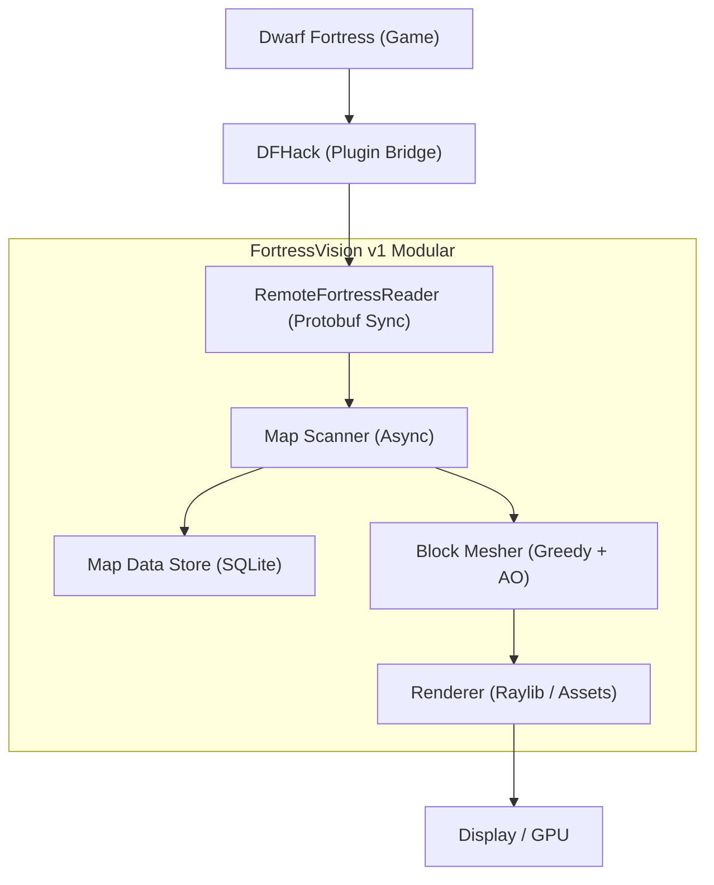
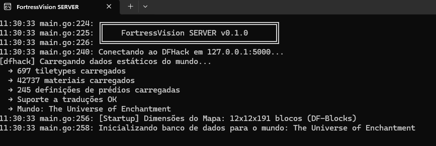
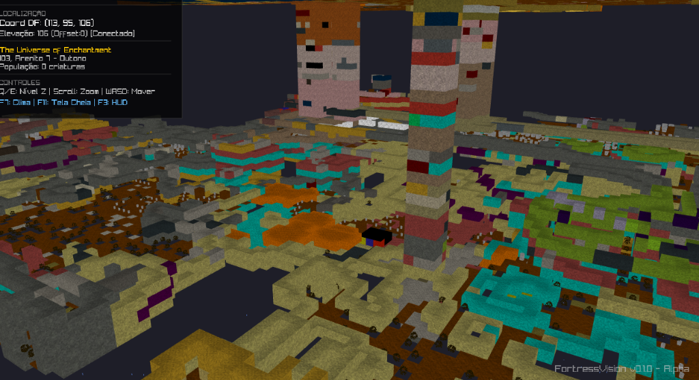
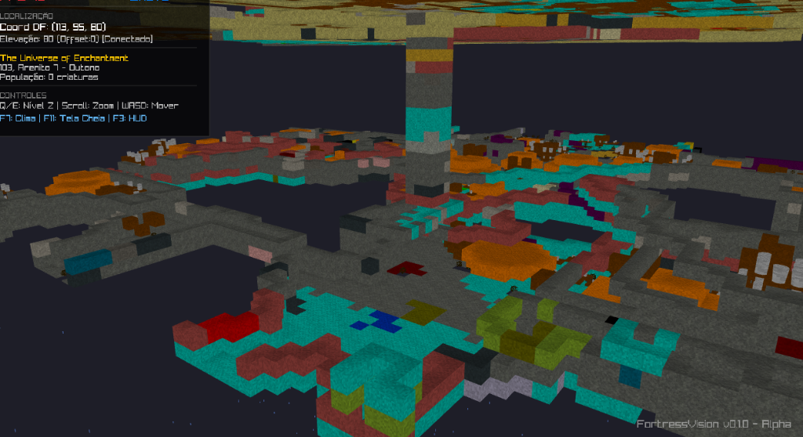

# FortressVision v1


**FortressVision** é um visualizador 3D de alta performance para **Dwarf Fortress**, construído utilizando **Go** e a biblioteca gráfica **Raylib**. Ele se conecta ao DFHack para extrair dados em tempo real da sua fortaleza e renderizá-los em um ambiente tridimensional imersivo.

## 🧭 Como Funciona

O FortressVision atua como um sistema modular que "escuta" o estado do mundo do Dwarf Fortress via gRPC e o reconstrói localmente.



## 📸 Galeria

| Servidor em Operação | Visualização do Mundo (Exemplo 1) |
|:---:|:---:|
|  |  |

| Visualização do Mundo (Exemplo 2) |
|:---:|
|  |

## 🚀 Principais Funcionalidades

### 🏗️ Renderização Otimizada (Greedy Meshing & AO)
Utilizamos um algoritmo de **Greedy Meshing** para reduzir drasticamente o número de polígonos. A versão **v1** introduz **Ambient Occlusion (AO)** calculado por vértice, garantindo sombras realistas e profundidade visual sem perda de performance.

### 💾 Persistência e Carga Offline (SQLite)
O projeto integra um banco de dados local **SQLite**. Cada mundo visitado é salvo automaticamente, permitindo carregar o terreno instantaneamente no próximo boot. O sistema de "Pre-heating" foi otimizado para a nova estrutura modular.

### 🌊 Fluidos Dinâmicos e Shaders
A água e o magma utilizam **Surface Merging** para criar superfícies contínuas. Implementamos **Flowing Shaders** dinâmicos e transparência real baseada na profundidade do fluido recebida do DFHack.

### 💎 Sincronização de Protocolo
Totalmente compatível com o protocolo mais recente do **DFHack (53.10-r1)**, garantindo que todas as unidades, itens, construções e novos tipos de materiais sejam reconhecidos e renderizados corretamente.

### ⚡ Performance Extrema
- **Memory Pooling:** Uso intensivo de `sync.Pool` para reciclar buffers de geometria.
- **Arquitetura Modular:** Separação entre `/cliente`, `/servidor` e `/shared` para melhor manutenção.
- **Async Processing:** Scanner e Mesher rodam em background para evitar travas na UI.

## 🛠️ Tecnologias Utilizadas

*   **Linguagem:** Go (Golang) 1.21+
*   **Gráficos:** Raylib (via CGO)
*   **Protocolo:** Protobuf (Sincronizado com DFHack 53.10-r1)
*   **Persistência:** GORM + SQLite

## 📦 Como Compilar

### Pré-requisitos
1.  Instale o **Go 1.21+**.
2.  Instale um compilador C (Recomendado: **MingW-w64**).
3.  Tenha o **Dwarf Fortress** com **DFHack** rodando.

### Build (Builder Unificado)
Para compilar todo o ecossistema (Servidor + Cliente + Launcher):

```bash
# Execute o builder na raiz do projeto
go run builder/main.go
```

## 🎮 Como Usar

1.  Inicie o **Dwarf Fortress**.
2.  Inicie o `FortressVision.exe` gerado na raiz.
3.  **Controles Básicos:**
    *   **Mouse/WASD/Q/E:** Movimentação e Câmera.
    *   **F3:** HUD de Depuração.
    *   **F11:** Tela Cheia.
    *   **ESC:** Sair.

---
*Desenvolvido focado em performance e fidelidade técnica ao simulador original.*
