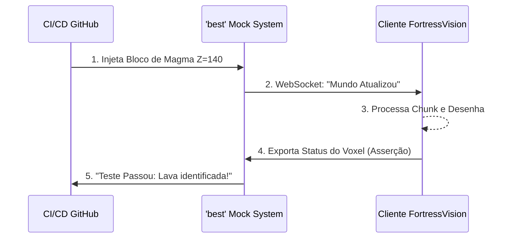

# 📚 Referências de Arquitetura em Go para o FortressVision

> [!NOTE]
> Este documento consolida a análise de repositórios de código aberto em Go que abordam problemas arquiteturais críticos semelhantes aos enfrentados pelo **FortressVision** (ex: sincronia procedural, meshing de Voxel 3D e simulação/testes "headless").

---

## 🎲 1. `opd-ai/venture` (O Labirinto Infinito)
**Repositório:** [`opd-ai/venture`](https://github.com/opd-ai/venture)

Este projeto é um Action-RPG 2D *"fully procedural"*, nativo em Go (usando *Ebiten*). Seu `pkg/world` brilha pela forma escalável como lida com infinitude baseada em *seeds*.

### Como o fluxo de Rede/ECS se aplica ao FortressVision:
```mermaid
graph TD
    subgraph Servidor [Servidor Otimizado (venture-style)]
        D[DFHack RAM] -->|Varredura de Blocos| L[Lógica ECS]
        L -->|Compactação| S[Snapshot do Mundo]
    end
    subgraph Cliente [Cliente 3D]
        C[Buffer de Rede] -->|Sincronia Suave| R[Renderização Raylib]
    end
    S -->|Transmissão Alta Latência WebSocket| C
    style Servidor fill:#2a3a2a,stroke:#4a5a4a
    style Cliente fill:#2a2a3a,stroke:#4a4a5a
```

| Ponto Forte | Descrição Técnica | Aplicação no FortressVision |
| :--- | :--- | :--- |
| **ECS Limpo** | Implementa de forma exemplar o padrão *Entity-Component-System*, que separa dados lógicos da renderização. | Essencial para o momento em que precisarmos povoar Dwarf Fortress com centenas de **Anões** e **Invasores** se movendo simultaneamente pelo forte sem engasgar o servidor. |
| **Rede Resiliente** | Suporta conexões de alta latência (usando *snapshots* de estado e compensação de lag). | Nosso fluxo (DFHack → WebSocket → Cliente) depende de absorver flutuações. Este repositório mostra como criar "buffers" macios de pacotes de dados. |

> [!TIP]
> A lógica de _Autômatos Celulares_ e _Voronoi_ empregada aqui serve perfeitamente para implementarmos futuras interpolações de relevos e biomas (suavização de terrenos).

---

## 🧊 2. `tehcyx/goengine` (O Parente Voxel)
**Repositório:** [`tehcyx/goengine`](https://github.com/tehcyx/goengine)

Uma autêntica engine Voxel em Go integrando OpenGL diretamente. Basicamente, os alicerces cruciais para um clone tridimensional estilo *Minecraft*.

### Como o Greedy Meshing transforma o Rendering:
```mermaid
graph LR
    subgraph Abordagem Ingênua [Milhares de cubos soltos]
        A[Cubo 1] --- B[Cubo 2]
        B --- C[Cubo 3]
        C --- D[Cubo 4]
    end
    
    Abordagem Ingênua -->|Greedy Meshing goengine-style| M(Otimização Matemática da Malha)
    M --> F(Uma Única Malha Plana: Geometria Oca)
    
    style Abordagem Ingênua fill:#5a2a2a,stroke:#7a4a4a,stroke-dasharray: 5 5
    style F fill:#2a5a2a,stroke:#4a7a4a
```

| Ponto Forte | Descrição Técnica | Aplicação no FortressVision |
| :--- | :--- | :--- |
| **O.G. Meshing** | Trata o pesadelo matemático da renderização em blocos desenhando *apenas faces externas*. | O coração do nosso futuro código! Desenharemos paredes de montanhas colossais convertendo milhares de minúsculos blocos internos de pedra nas famosas **"Chunk Meshes"** simplificadas. |
| **Baixo Nível 3D** | Lidando puramente com CGO em primitivas limpas. | Evita reinventar a roda ao enviar VBOs massivos de pedras polidas e gemas cintilantes nativamente pela Raylib. |

> [!WARNING]
> Sem algoritmos como **Greedy Meshing** (amplamente cobertos nestes exemplos), rodar o *FortressVision* em montanhas altas (Z: 140) sufocaria a placa de vídeo com milhões de triângulos invisíveis "presos dentro" da montanha.

---

## 🔬 3. `gollilla/best` (O Testador Cínico)
**Repositório:** [`gollilla/best`](https://github.com/gollilla/best) *(Bedrock Edition Server Testing)*

Um framework de Testes Automatizados sofisticado feito sob-medida para ser "espetado" em um servidor *Minecraft Bedrock*.

### A Abordagem de Teste Contínuo no Pipeline:


| Ponto Forte | Descrição Técnica | Aplicação no FortressVision |
| :--- | :--- | :--- |
| **Asserções de Mundo** | Uma biblioteca focada exclusivamente em checar e isolar lógicas de blocos: _"O tijolo de argila realmente está na coordenada [X, Y, Z] e se comporta como argila?"_ | O *FortressVision* interage passivamente com um Mestre (o DFHack). Podemos injetar "Eventos Fantasmas" (`[Magma Flowing]`) usando testes unitários baseados na arquitetura do `best` para testar as reações do Cliente sem precisar sequer abrir o simulador do Dwarf Fortress! |
| **Protocolo Headless** | Finge simular "clientes reais" jogando e reagindo. | Pode se tornar nossa barreira defensiva natural contra atualizações surpresas (Breaking Changes) da API RPC do DFHack nas versões futuras, rodando no GitHub Actions automaticamente. |

---
**💡 Resumo Executivo:** O `venture` dita como distribuímos e organizamos centenas de variáveis complexas e entidades no pacote de rede (`network.go`/`store.go`). O `goengine` nos revela a chave de otimização de matriz que destravará 120 FPS fixos. O `best` nos inspira como montar testes de "caixa-preta" e impedir regressões graves!

